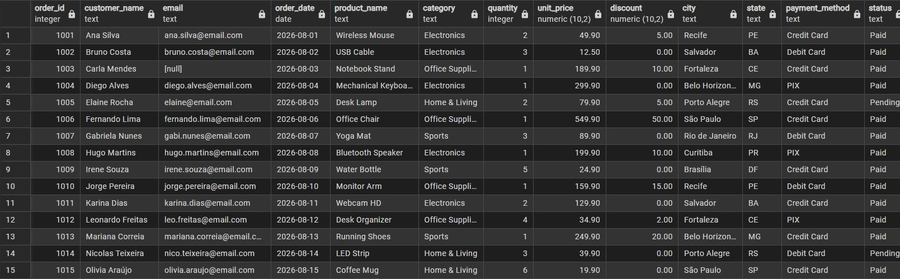
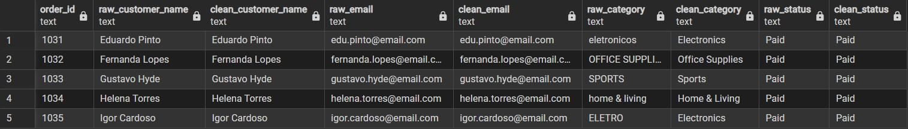
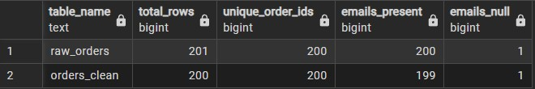

# Data Cleaning and Validation — PostgreSQL

## Overview
This project demonstrates end-to-end data cleaning and validation using PostgreSQL. It works with a raw orders dataset containing common quality issues (missing values, duplicates, inconsistent formats, outliers). The goal is to produce a clean, analysis-ready table and document the rules applied.

## Dataset
- Source: `raw_orders.csv`.
- Columns: `order_id`, `customer_name`, `email`, `order_date`, `product_name`, `category`, `quantity`, `unit_price`, `discount`, `city`, `state`, `payment_method`, `status`.
- Known issues: missing emails and discounts, inconsistent date formats, category/status text variations, duplicate rows, and invalid quantity/price values.

## Cleaning Rules
1. `order_id`: keep only numeric IDs; convert to INTEGER.
2. `order_date`: standardize to `YYYY-MM-DD` and convert to DATE.
3. `category`: normalize to a fixed set (`Electronics`, `Office Supplies`, `Home & Living`, `Sports`).
4. `status`: normalize to `Paid`, `Pending`, `Cancelled`.
5. `quantity`: remove rows with `quantity <= 0`; cap at 100.
6. `unit_price`: remove rows with `unit_price <= 0`.
7. `discount`: default to 0 when missing.
8. Duplicates: remove exact duplicate rows; keep first occurrence per `order_id`.

## Validation
- Row counts before/after cleaning.
- Null counts per column in the clean table.
- Duplicate `order_id` check.
- Simple email format validation (must contain `@` and `.`).
- Quantity and unit_price range checks.

## Results
- Rows: raw = 201, clean = 200, 1 row removed (duplicate `order_id` 1001).
- Nulls: only `email` with 1 null (before and after).
- Categories: Electronics 71, Office Supplies 59, Sports 49, Home & Living 21.
- Status: Paid 197, Pending 3, Cancelled 0.
- Ranges: quantity 1–6, unit_price 12.50–899.90 (no negatives/zero).
- Invalid emails: none.

### Final Validation Summary

| Table | Total Rows | Unique Order IDs | Emails Present | Emails Null |
|---|---:|---:|---:|---:|
| `raw_orders` | 201 | 200 | 200 | 1 |
| `orders_clean` | 200 | 200 | 199 | 1 |

One duplicate order record was removed, reducing the dataset from 201 to 200 rows. The cleaned table retained 200 unique order IDs and preserved the existing one missing email value without introducing additional nulls.

## How to Use
1. Create a PostgreSQL database (e.g., `cleaning_validation`).
2. Run `01_create_raw_table.sql`.
3. Run `02_import_csv.sql` (adjust the file path if needed).
4. Run `03_create_clean_table.sql`.
5. Run `04_cleaning_rules.sql`.
6. Run `05_validation_checks.sql` and `06_before_after_summary.sql` to review quality.

## Files
- `raw_orders.csv`: raw dataset.
- `SQL/01_create_raw_table.sql`: creates the raw table.
- `SQL/02_import_csv.sql`: imports CSV into raw table.
- `SQL/03_create_clean_table.sql`: creates the cleaned table schema.
- `SQL/04_cleaning_rules.sql`: applies cleaning transformations (includes deduplication).
- `SQL/05_validation_checks.sql`: validation queries.
- `SQL/06_before_after_summary.sql`: before/after summary.
- `01_raw_orders_before_cleaning.png` — Raw orders dataset before cleaning.
- `02_raw_vs_clean_comparison.png` — Before-and-after comparison of selected records.
- `03_validation_summary.jpg` — Final SQL validation summary.

## Screenshots

### Raw Orders Before Cleaning

### Raw vs. Clean Comparison

### Final Validation Summary

## Author

Antonio Souza

## Copyright

© 2026 Antonio Souza. This project is provided for portfolio and educational purposes only.
